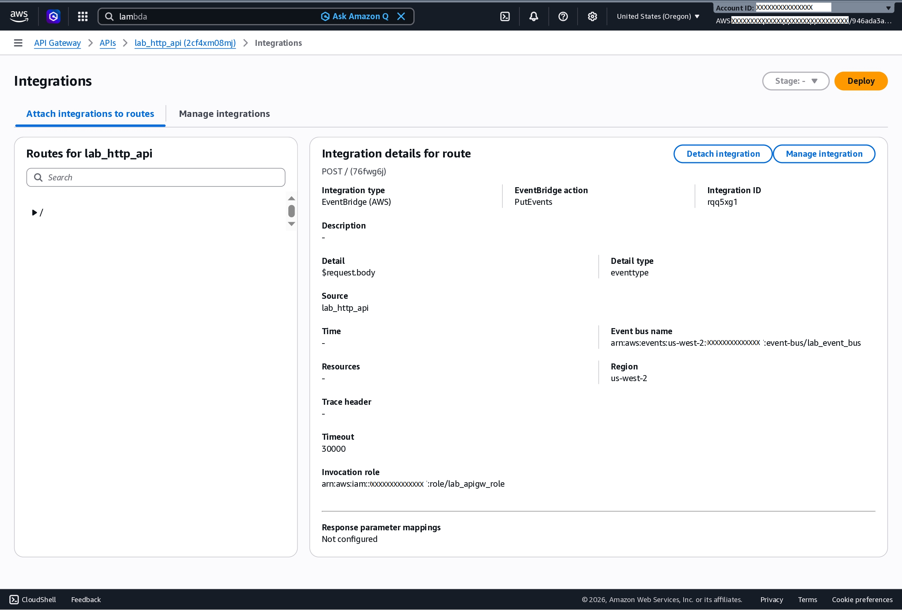
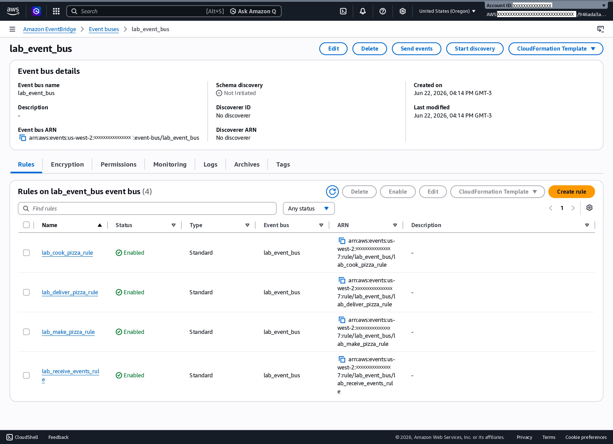
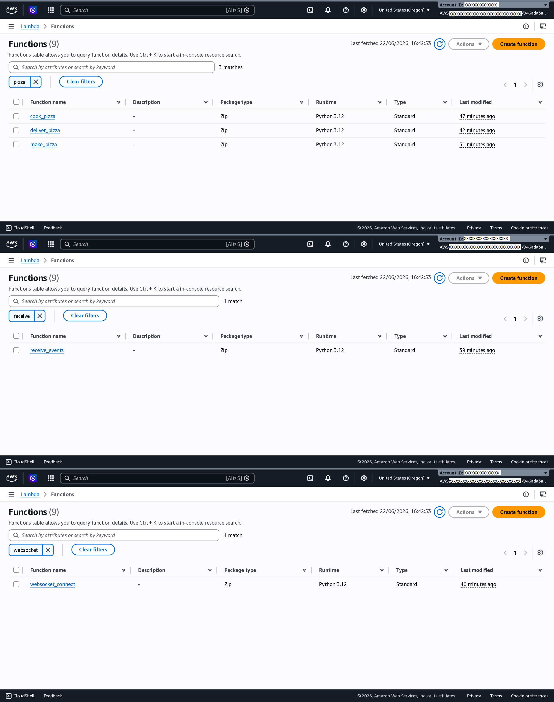

# AWS Event-Driven Architecture Lab


## Architecture


## Overview

This project demonstrates an event-driven serverless architecture built on AWS using:

- Amazon API Gateway (HTTP API)
- Amazon API Gateway WebSocket API
- Amazon EventBridge
- AWS Lambda
- Amazon DynamoDB

The application simulates a pizza ordering workflow where events are processed asynchronously through multiple Lambda functions.


## Event Flow

1. Client sends a pizza order through API Gateway HTTP API.
2. API Gateway publishes the event to EventBridge.
3. EventBridge routes the event to the appropriate Lambda function.
4. Lambda functions process the order sequentially:
   - make_pizza
   - cook_pizza
   - deliver_pizza
5. Events are sent back to connected clients through a WebSocket API.
6. DynamoDB stores active WebSocket connection IDs.


## AWS Services Used

- Amazon API Gateway (HTTP API)
- Amazon API Gateway (WebSocket API)
- Amazon EventBridge
- AWS Lambda
- Amazon DynamoDB
- IAM


## API Gateway HTTP API

The application uses an Amazon API Gateway HTTP API as the entry point for incoming requests.

A `POST /` route is configured with a direct integration to Amazon EventBridge using the `PutEvents` action. When a client submits an order, the request payload is forwarded to the custom event bus (`lab_event_bus`), where EventBridge routes events to the appropriate Lambda functions for processing.

This approach enables a loosely coupled, event-driven architecture that improves scalability and maintainability.




## Amazon EventBridge Rules

Amazon EventBridge serves as the central event router for the application.

A custom event bus (`lab_event_bus`) receives events from the API Gateway HTTP API and routes them to the appropriate Lambda functions through four event rules:

* `lab_make_pizza_rule`
* `lab_cook_pizza_rule`
* `lab_deliver_pizza_rule`
* `lab_receive_events_rule`

This event-driven approach decouples application components and enables scalable, asynchronous processing of pizza orders.




## Lambda Functions

The application uses five AWS Lambda functions to implement the event-driven workflow and WebSocket communication.

| Function          | Purpose                                            |
| ----------------- | -------------------------------------------------- |
| make_pizza        | Receives order and emits cook_pizza event          |
| cook_pizza        | Processes pizza and emits deliver_pizza event      |
| deliver_pizza     | Processes delivery and emits delivered event       |
| websocket_connect | Stores WebSocket connection IDs                    |
| receive_events    | Sends EventBridge events back to connected clients |




## WebSocket API

Amazon API Gateway WebSocket API enables real-time event notifications. The `$connect` route is integrated with a Lambda function that manages client connections, allowing processed events to be pushed back to connected users.


## End-to-End Test

### Request Payload

```json
{
  "item": {
    "order_id": "1AB",
    "eventtype": "make_pizza"
  }
}
```

### Processing Flow

```text
make_pizza
    ↓
cook_pizza
    ↓
deliver_pizza
```


## Skills Demonstrated

- Event-Driven Architecture
- Serverless Computing
- API Integration
- WebSocket Communication
- Asynchronous Processing
- AWS Lambda Development
- EventBridge Rule Design
- DynamoDB Integration


## Author

**Ze Mendes**

Information Security Analyst with experience in Cloud Infrastructure, Cybersecurity, Governance and Automation.

- GitHub: https://github.com/zcmendes
- LinkedIn: https://www.linkedin.com/in/zcmendes
