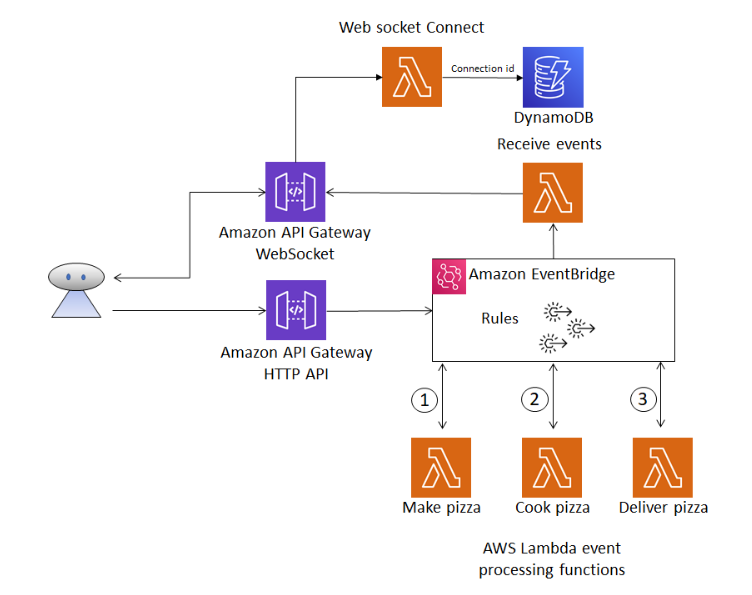
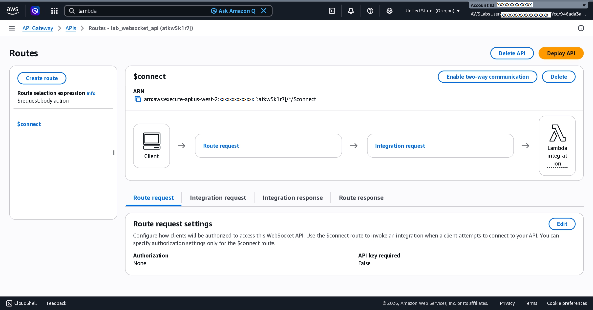
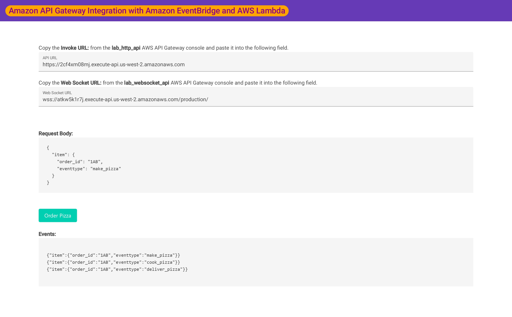

# AWS Event-Driven Architecture Lab

## Architecture

## Overview

This project demonstrates an event-driven serverless architecture built on AWS using:

- Amazon API Gateway (HTTP API)
- Amazon API Gateway WebSocket API
- Amazon EventBridge
- AWS Lambda
- Amazon DynamoDB

The application simulates a pizza ordering workflow where events are processed asynchronously through multiple Lambda functions.

## Event Flow

1. Client sends a pizza order through API Gateway HTTP API.
2. API Gateway publishes the event to EventBridge.
3. EventBridge routes the event to the appropriate Lambda function.
4. Lambda functions process the order sequentially:
   - make_pizza
   - cook_pizza
   - deliver_pizza
5. Events are sent back to connected clients through a WebSocket API.
6. DynamoDB stores active WebSocket connection IDs.

## AWS Services Used

- Amazon API Gateway (HTTP API)
- Amazon API Gateway (WebSocket API)
- Amazon EventBridge
- AWS Lambda
- Amazon DynamoDB
- IAM

## Lambda Functions

| Function | Purpose |
|-----------|-----------|
| make_pizza | Receives order and emits cook_pizza event |
| cook_pizza | Processes pizza and emits deliver_pizza event |
| deliver_pizza | Processes delivery and emits delivered event |
| websocket_connect | Stores WebSocket connection IDs |
| receive_events | Sends EventBridge events back to connected clients |

## WebSocket API

Amazon API Gateway WebSocket API enables real-time event notifications. The `$connect` route is integrated with a Lambda function that manages client connections, allowing processed events to be pushed back to connected users.

## End-to-End Test

The application successfully processed the order through the event-driven workflow.

Request:
make_pizza

Events received:
- make_pizza
- cook_pizza
- deliver_pizza

## Skills Demonstrated

- Event-Driven Architecture
- Serverless Computing
- API Integration
- WebSocket Communication
- Asynchronous Processing
- AWS Lambda Development
- EventBridge Rule Design
- DynamoDB Integration

## Author

**Ze Mendes**

Information Security Analyst with experience in Cloud Infrastructure, Cybersecurity, Governance and Automation.

- GitHub: https://github.com/zcmendes
- LinkedIn: https://www.linkedin.com/in/zcmendes
